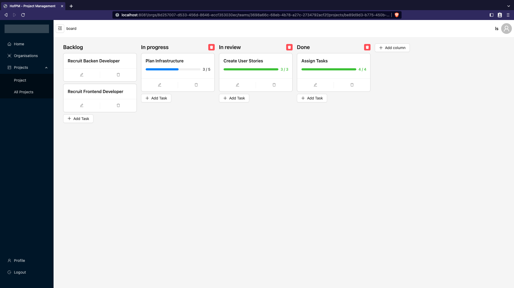
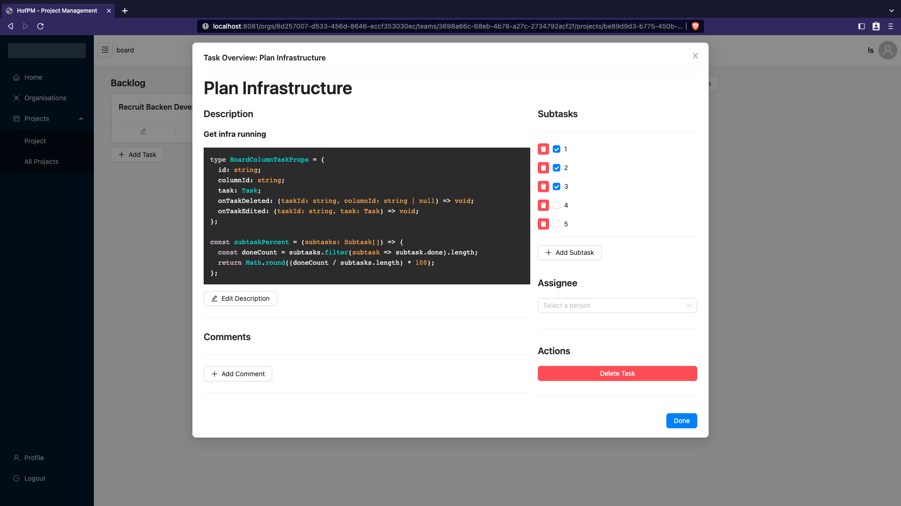

# Project Management Software

This repository contains the frontend client for a project management solution created for a university course.

## Technologies used

- **Frontend**: React
- **Backend**: NestJS
- **Language**: Typescript
- **UI Library**: [ant design](https://ant.design/)
- **Drag and Drop**: react-beautiful-dnd
- **Build Tool**: vite
